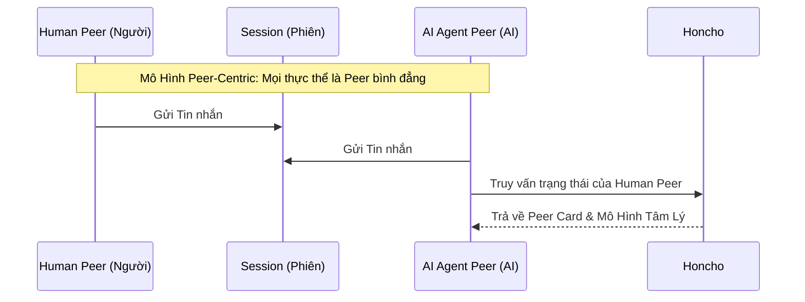
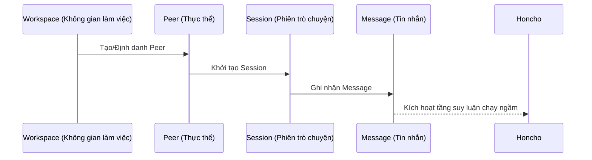
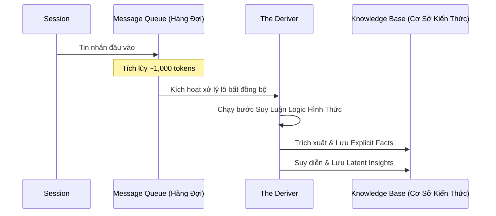
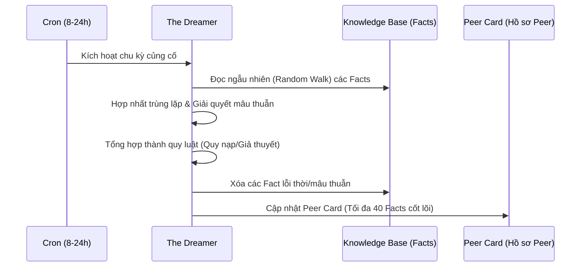
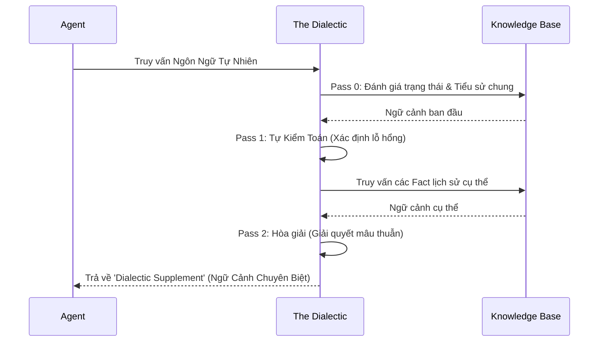
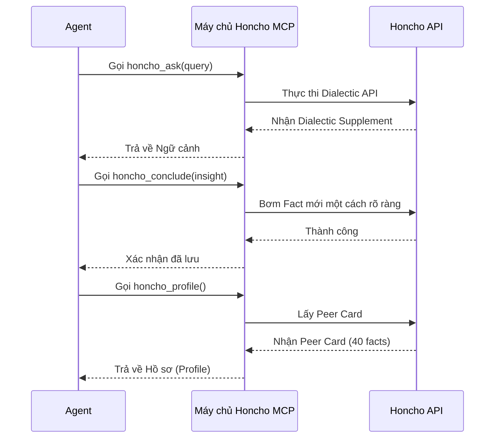
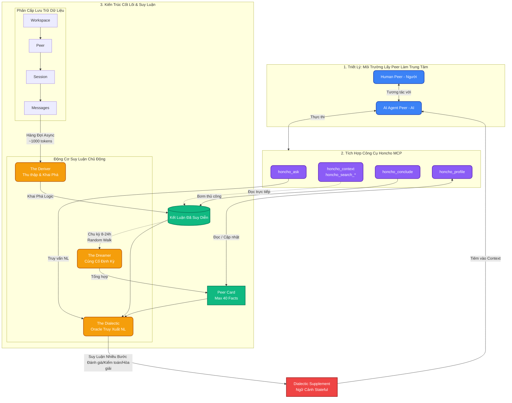

# Báo Cáo Nghiên Cứu: Kiến Trúc Dịch Vụ Bộ Nhớ Honcho

## 1. Nền Tảng Triết Lý (Philosophical Foundations)
Honcho tạo ra sự khác biệt so với hệ thống RAG (Retrieval-Augmented Generation) thụ động truyền thống bằng cách đi tiên phong trong phương pháp tiếp cận **bộ nhớ chủ động, định hướng suy luận (active, reasoning-driven memory)**. Mục tiêu của nó không chỉ đơn thuần là trích xuất sự kiện, mà là tạo ra "mô phỏng trạng thái" (stateful simulation) thực sự thông qua việc xây dựng các mô hình tâm lý mạch lạc cho các thực thể.
- **Logic Hình Thức (Formal Logic) vs. Văn Bản Có Thể Xảy Ra (Plausible Text)**: Honcho tận dụng các mô hình ngôn ngữ tùy chỉnh được huấn luyện bằng logic hình thức để trích xuất các kiến thức tiềm ẩn và đưa ra các kết luận suy diễn, thay vì chỉ làm nổi bật các đoạn văn bản tương tự nhau.
- **Mô Hình Lấy Peer Làm Trung Tâm (The Peer-Centric Paradigm)**: Honcho từ bỏ cấu trúc "người dùng vs. trợ lý" truyền thống. Tất cả các thực thể—con người, AI agent, hay các nhóm—đều được đối xử bình đẳng như những "Peers" (Người dùng ngang hàng). Điều này cho phép các hệ thống multi-agent mô phỏng và suy luận về các agent khác chính xác theo cách chúng mô phỏng người dùng con người.

## 2. Kiến Trúc Cốt Lõi (Core Architecture)
Hệ thống sử dụng một mô hình dữ liệu phân cấp (`Workspaces -> Peers -> Sessions -> Messages`) và chia các hoạt động thành một tầng lưu trữ bộ nhớ tiêu chuẩn và một Tầng Suy Luận (Reasoning Layer) chạy ngầm. Tầng Suy Luận bao gồm ba agent chính:

### The Deriver (Bộ Thu Thập & Khai Phá)
- Đóng vai trò là động cơ suy luận tức thì cho dữ liệu đầu vào.
- Xử lý các tin nhắn một cách bất đồng bộ thông qua hàng đợi (queue).
- Sử dụng **token batching** (kích hoạt suy luận mỗi khi gom đủ ~1,000 tokens) để đảm bảo có đủ ngữ cảnh có ý nghĩa trong khi vẫn giữ chi phí API ở mức thấp.
- Trích xuất các sự thật rõ ràng (explicit facts) và suy diễn ra các hiểu biết tiềm ẩn (unstated deductive insights).

### The Dreamer (Bộ Củng Cố)
- Là một agent bảo trì chạy ngầm định kỳ mỗi 8 đến 24 giờ.
- Thực hiện một chuyến "đi dạo ngẫu nhiên" (random walk) qua các quan sát về peer để củng cố bộ nhớ: hợp nhất những thông tin dư thừa, xóa bỏ các thông tin lỗi thời hoặc mâu thuẫn, và tổng hợp các sự kiện cụ thể thành những quy luật rộng lớn hơn (thông qua quy nạp và suy luận giả thuyết).
- Đầu ra chính của nó là **Peer Card**, một hồ sơ tiểu sử siêu nén (bị giới hạn cứng ở 40 sự kiện) được tiêm trực tiếp vào prompt của agent nhằm bỏ qua độ trễ của quá trình truy xuất (retrieval latency).

### The Dialectic (Bộ Truy Xuất & Tổng Hợp)
- Là một API truy xuất ngôn ngữ tự nhiên đóng vai trò "Nhà Tiên Tri" (Oracle) để truy vấn bộ nhớ của peer.
- Sử dụng **Suy Luận Nhiều Bước (Multi-Pass Reasoning)**: Bước 0 (Đánh giá), Bước 1 (Tự Kiểm Toán), và Bước 2 (Hòa giải các mâu thuẫn).
- Tự động chuyển đổi giữa chế độ "Cold Start" (tiểu sử rộng) và "Warm Session" (thu hẹp trong ngữ cảnh gần đây).
- Đầu ra là một **Dialectic Supplement**—phần suy luận được tổng hợp bởi LLM theo thời gian thực về các nhu cầu hiện tại của người dùng—được tiêm vào cùng với ngữ cảnh gốc trong mọi lượt hội thoại.

## 3. Tích Hợp Công Cụ Honcho MCP
Máy chủ Honcho Model Context Protocol (MCP) cung cấp cho các agent khả năng thao tác trực tiếp lên tầng bộ nhớ:

- `honcho_context`: Truy xuất toàn bộ biểu diễn người dùng xuyên suốt các phiên (tóm tắt, peer cards, các quan sát liên quan).
- `honcho_ask`: Công cụ Hỏi-Đáp hỗ trợ bởi LLM tận dụng API Dialectic. Hỗ trợ cấu hình độ sâu của suy luận (nhanh vs. chi tiết).
- `honcho_conclude`: Cho phép agent lưu rõ ràng một insight hoặc một sự kiện mới dưới dạng "kết luận" (conclusion).
- `honcho_profile`: Truy xuất hoặc cập nhật "peer card" (hồ sơ tiểu sử) của người dùng.
- `honcho_search_conclusions`: Thực hiện tìm kiếm ngữ nghĩa trên các insight đã được suy luận để thu hồi sự kiện với độ trung thực cao.
- `honcho_search_messages`: Truy vấn các tin nhắn lịch sử trong phiên (có thể lọc theo ngày tháng và người gửi).
- `get_config` / `set_config`: Các công cụ tiện ích để lập trình kiểm tra hoặc sửa đổi các cấu hình bộ nhớ.

## 4. Biểu Đồ Trực Quan

### 4.1 Bản Đồ Toàn Cảnh (Comprehensive Honcho Master Pipeline)
Biểu đồ này trực quan hóa cách mà Nền Tảng Triết Lý (Peer-Centric), Kiến Trúc Dữ Liệu, Động Cơ Suy Luận Chủ Động (Deriver, Dreamer, Dialectic) và Tích Hợp Công Cụ MCP được kết nối vào một luồng thống nhất.

