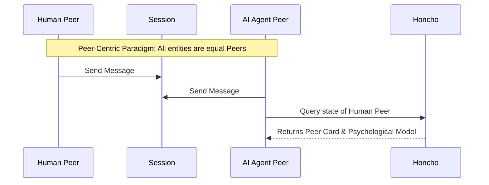
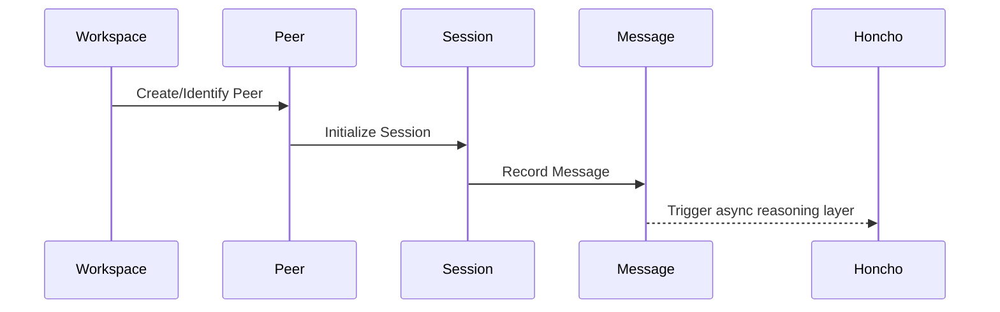
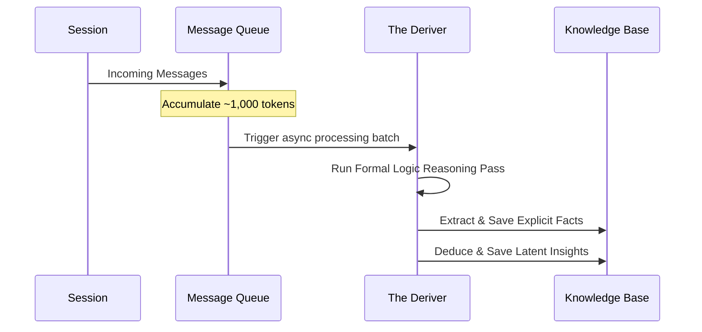
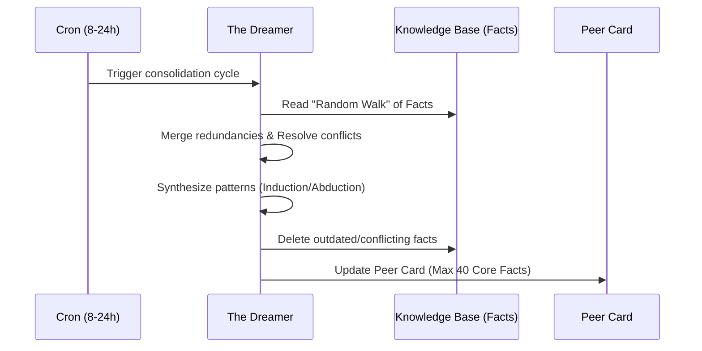
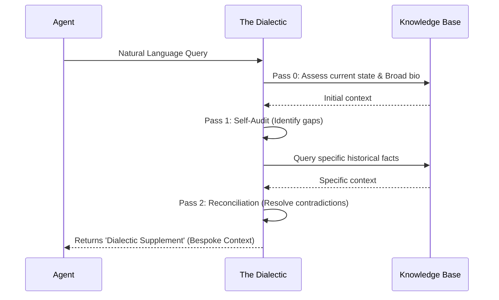
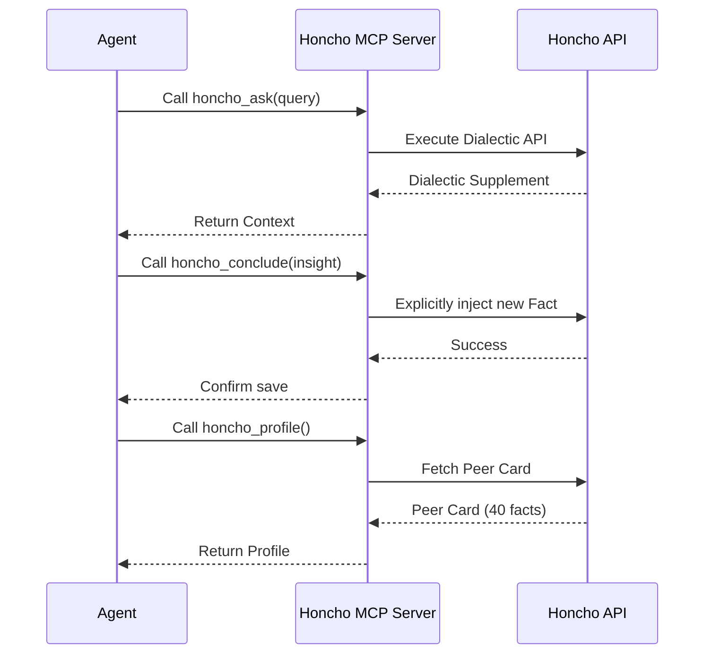
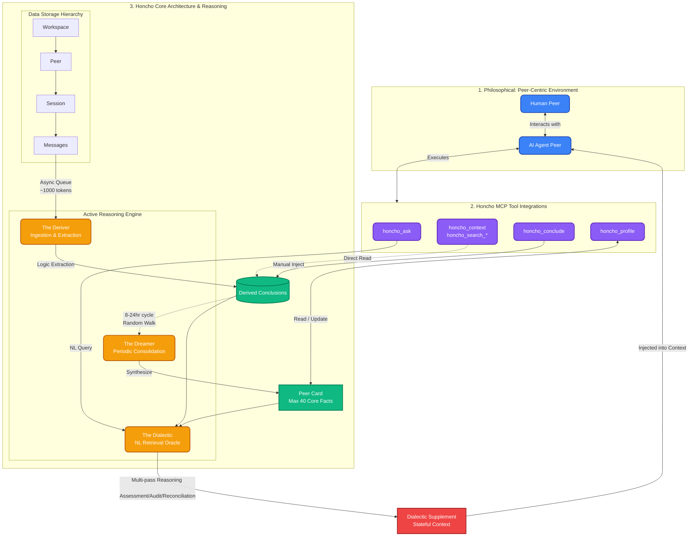

# Research Report: Honcho Memory Service Architecture

## 1. Philosophical Foundations
Honcho distinguishes itself from traditional passive Retrieval-Augmented Generation (RAG) by championing an **active, reasoning-driven memory** approach. Its goal is not mere fact retrieval, but true "stateful simulation" achieved by constructing coherent psychological models of entities. 
- **Formal Logic vs. Plausible Text**: Honcho leverages custom language models trained in formal logic to extract latent knowledge and draw deductive conclusions rather than just surfacing similar text chunks.
- **The Peer-Centric Paradigm**: Honcho abandons the traditional "user vs. assistant" dynamic. All entities—humans, agents, or groups—are equally treated as "Peers". This allows multi-agent systems to model and reason about other agents exactly as they do human users.

## 2. Core Architecture
The system employs a hierarchical data model (`Workspaces -> Peers -> Sessions -> Messages`) and splits operations into a standard memory storage layer and a background Reasoning Layer. The Reasoning Layer consists of three key agents:

### The Deriver (Ingestion & Extraction)
- Acts as the immediate reasoning engine for incoming data.
- Processes messages asynchronously via a queue.
- Uses **token batching** (triggering inference roughly every 1,000 tokens) to ensure meaningful context while keeping API costs low. 
- Extracts explicit facts and derives unstated deductive insights.

### The Dreamer (Consolidation)
- A background maintenance agent running every 8 to 24 hours.
- Performs a "random walk" across peer observations to consolidate memory: merging redundancies, deleting outdated or conflicting information, and synthesizing specific facts into broader patterns (induction and abduction).
- Its primary output is the **Peer Card**, a highly compressed biographical profile (hard-capped at 40 facts) that is injected into the agent's prompt to bypass retrieval latency.

### The Dialectic (Retrieval & Synthesis)
- A natural language retrieval API that acts as an "Oracle" for querying peer memory.
- Uses **Multi-Pass Reasoning**: Pass 0 (Assessment), Pass 1 (Self-Audit), and Pass 2 (Reconciliation of contradictions).
- Automatically toggles between "Cold Start" (broad biography) and "Warm Session" (scoped to recent context).
- Outputs a **Dialectic Supplement**—real-time LLM-synthesized reasoning about the user's current needs—which is injected alongside the base context on every conversational turn.

## 3. Honcho MCP Tool Integrations
The Honcho Model Context Protocol (MCP) server provides agents with direct manipulation capabilities over the memory layer:

- `honcho_context`: Retrieves the full cross-session user representation (summaries, peer cards, relevant observations).
- `honcho_ask`: An LLM-powered Q&A tool leveraging the Dialectic API. Supports configurable reasoning depths (quick vs. thorough).
- `honcho_conclude`: Allows the agent to explicitly save a new insight or fact as a "conclusion".
- `honcho_profile`: Retrieves or updates the user's biographical "peer card".
- `honcho_search_conclusions`: Performs semantic search over the derived insights for high-fidelity fact recall.
- `honcho_search_messages`: Queries historical session messages (filterable by date and sender).
- `get_config` / `set_config`: Utility tools to programmatically inspect or modify memory configurations.

## 4. Visual Diagrams

### 4.1 Comprehensive Honcho Master Pipeline
This diagram visualizes how the Philosophical Foundations (Peer-Centric), Data Architecture, Active Reasoning Engines (Deriver, Dreamer, Dialectic), and the MCP Tool Integrations all connect into a single unified flow.

